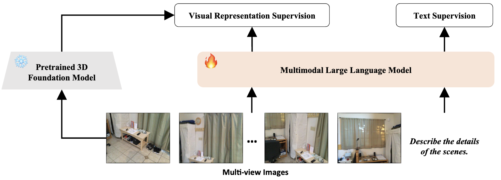
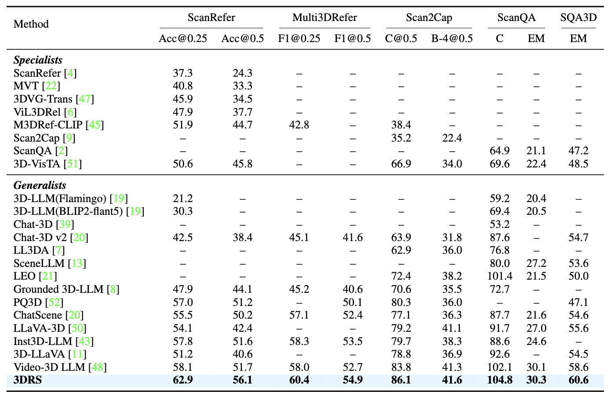
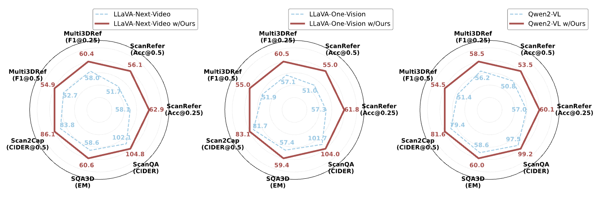

# MLLMs Need 3D-Aware Representation Supervision for Scene Understanding

<div align="center" style="margin-bottom:2em;">
    <a href="https://arxiv.org/abs/xxx" target="_blank">
        
    </a>
    <a href="https://huggingface.co/datasets/OliverHuang1998/3DRS" target="_blank">
        
    </a>
    <a href="visual-ai.github.io/3drs" target="_blank">
        
    </a>
</div>

<div align="center" style="margin-bottom:2em;">
  <a target="_blank" href="https://scholar.google.com/citations?user=sBjFwuQAAAAJ&hl=en">Xiaohu Huang</a>,
  <a target="_blank" href="#">Jingjing Wu</a>,
  <a target="_blank" href="#">Qunyi Xie</a>,
  <a target="_blank" href="https://www.kaihan.org/">Kai Han<sup>*</sup></a>
  <br>
  <strong>
    Visual AI Lab, The University of Hong Kong & Baidu VIS
  </strong>
  <br>
  <sup>*</sup> Corresponding author
</div>

---

<p align="center">
    <br>
    <em>Overview of our 3DRS framework for 3D-aware representation supervision in MLLMs.</em>
</p>

---

## Introduction

Recent advances in Multimodal Large Language Models (MLLMs) have revolutionized multimodal reasoning, yet **scene understanding in complex 3D environments remains a challenge**. Existing MLLMs, primarily trained on 2D data, lack explicit 3D-aware representation, limiting their effectiveness in spatially-grounded tasks.

**We propose 3DRS**, a general framework that introduces explicit 3D-aware representation supervision into MLLMs using powerful 3D foundation models. By aligning the visual features of MLLMs with rich 3D representations, our method enables stronger geometric and spatial reasoning, bridging the gap between 2D pretraining and real-world 3D scene understanding.

---

## News

- **2025-06-03**: We release our paper [arXiv](https://arxiv.org/abs/xxx) and training code.

---

## State-of-the-Art Performance

<p align="center">
    
    <br>
    <em><b>3DRS achieves state-of-the-art results on ScanRefer, Multi3DRefer, Scan2Cap, ScanQA, and SQA3D.</b></em>
</p>

<p align="center">
    
    <br>
    <em><b>3DRS achieves consistent performance improvement on different MLLMs.</b></em>
</p>

---

## TODO List

- [x] Release the training code.
- [x] Release the evaluation script.
- [x] Release the training data.
- [ ] Release the model checkpoint.

---

## Installation

1. Clone this repository:
    ```bash
    git clone https://github.com/Visual-AI/3DRS.git
    cd 3DRS
    ```
2. Install dependencies:
    ```bash
    conda create -n 3drs python=3.10
    conda activate 3drs
    pip install --upgrade pip
    pip install -e ".[train]"
    pip install flash-attn --no-build-isolation     # install flash attention
    pip install -e transformers
    ```
---

## Preparing the training data

The processed training data is accessible at [here](https://huggingface.co/datasets/OliverHuang1998/3DRS). You can download it and put as `data/` folder.

## Extract VGGT features

You can choose to download the vggt features from [here](https://huggingface.co/datasets/OliverHuang1998/3DRS).

Or you can extract corresponding vggt features by yourself, where you need to download the VGGT model from [vggt](https://huggingface.co/facebook/VGGT-1B/blob/main/model.pt), and put in `checkpoints` folder.

```bash
python extract_vggt_feature
```

This script will extract the vggt features to `data/` folder.

## Model Preparation

The pre-trained LLaVA-Next-Video can be downloaded from [Hugging Face](https://huggingface.co/lmms-lab/LLaVA-Video-7B-Qwen2).

Please put it into `data/models` as `LLaVA-Video-7B-Qwen2` folder.

# Data Structure

The final data structure should be organized as follows:
```
data/
├── balanced/
├── benchmark/
├── embodiedscan/
├── metadata/
├── models/
   ├──LLaVA-Video-7B-Qwen2/
├── processed/
└── scannet/
   ├──mask/
   ├──pcd_with_object_aabbs/
   ├──posed_images/
   |──posed_images_3d_feature_vggt/
```

## Run the training and evaluation

```bash
sh train_eval.sh
```

You can modify the `MID_RUN_NAME` to change the name of an experiment, which should be consistent with the name in `train_eval.sh` file.

## Citation

If you find this work useful, please cite:

```bibtex
@inproceedings{huang2025,
  title={MLLMs Need 3D-Aware Representation Supervision for Scene Understanding},
  author={Xiaohu Huang and Jingjing Wu and Qunyi Xie and Kai Han},
  booktitle={arXiv},
  year={2025}
}